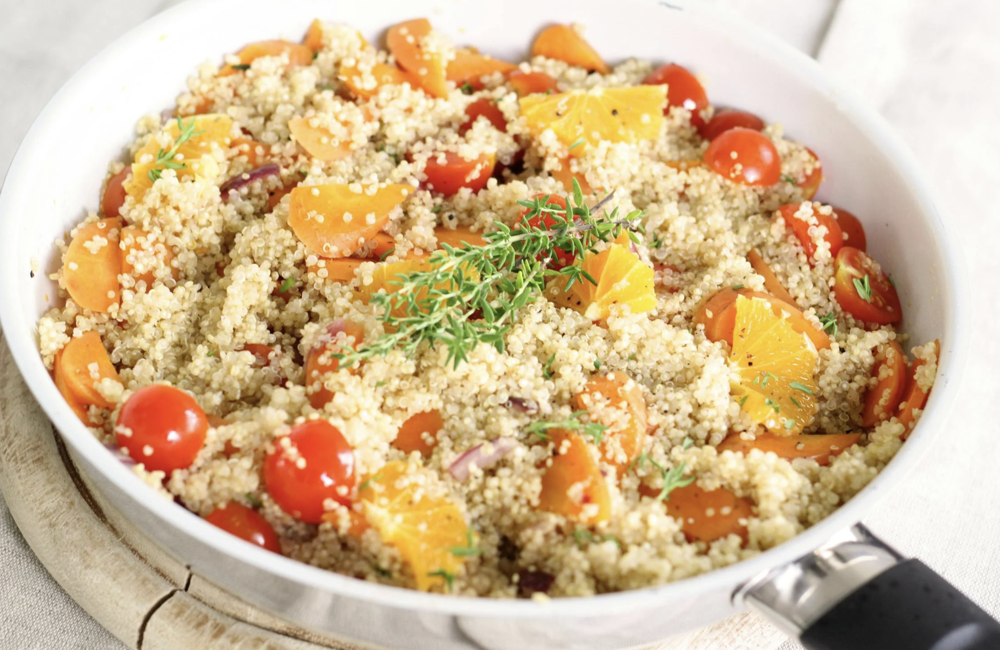
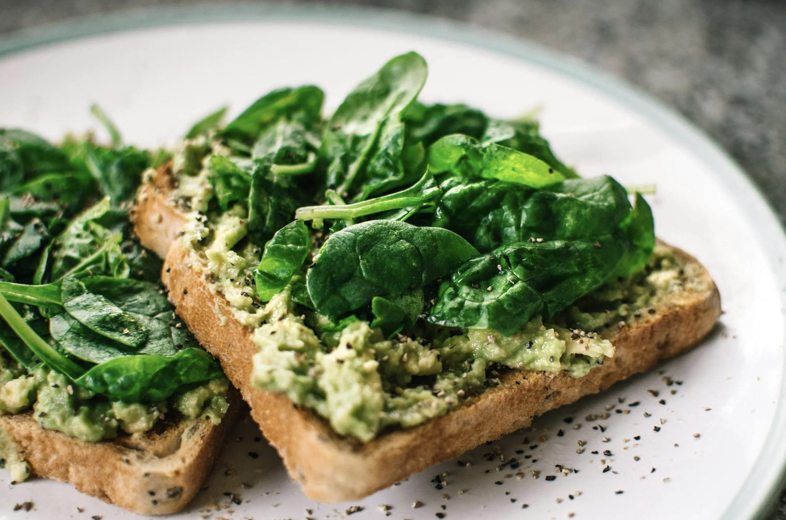

# 🌱 Green Queens – Vegane Austauschplattform

Willkommen bei **Green Queens**, der Plattform für alle, die vegane Ernährung lieben und teilen möchten.  
Hier kannst du **Rezepte entdecken, Erfahrungen austauschen** und nachhaltige Ideen verbreiten.

## 🚀 Funktionen

✅ **Rezeptdatenbank** – Entdecke vegane Gerichte 🍛  
✅ **Community-Erfahrungen** – Lese inspirierende Geschichten 💚  
✅ **Tauschbörse** – Tausche & finde nachhaltige Produkte 🔄  
✅ **Kontaktformular** – Vernetze dich mit Gleichgesinnten 📩

---

## 📦 Installation & Setup

### 1️⃣ Voraussetzungen
- **Browser** (Chrome, Firefox, Safari)
- **Webserver** (optional für lokale Entwicklung)

### 2️⃣ Projekt herunterladen
Lade das Projekt herunter oder klone es mit Git:
```bash
https://github.com/junesdream/green_queens
```

3️⃣ Starten (lokal)

Öffne die Datei index.html in deinem Browser:
```bash
open index.html  # macOS  
start index.html  # Windows  
```
4️⃣ Online-Version

Die Plattform ist hier erreichbar:
👉 Green Queens Online

## 🛠 Verwendete Technologien

| Technologie         | Verwendung                  |
|--------------------|---------------------------|
| **HTML5**         | Struktur der Seite        |
| **CSS3**          | Styling & Layout          |
| **Bootstrap 5**   | Responsive Design         |
| **JavaScript**    | Interaktive Features      |
| **LocalStorage API** | Speicherung von Rezepten |
| **Formspree**     | Kontaktformular           |


## 📂 Projektstruktur

```plaintext
📁 green-queens
 ├── 📄 index.html       # Hauptseite
 ├── 📄 style.css       # Stile & Layout
 ├── 📄 script.js       # Interaktive Funktionen
 ├── 📁 images/        # Bilder & Icons
 ├── 📄 README.md      # Diese Datei
 └── 📄 favicon.ico     # Webseiten-Icon
```

## 🔗 Quellenangaben

### 📸 Bilder
- **Pixabay & Pexels** – Lizenzfreie Stock-Fotos:
  
  
  
  

- **Und eigene Bilder** – Frei von den Gründern

### 🎨 Code & Inspiration
- **[Bootstrap](https://getbootstrap.com/)** – Framework für das Layout: Struktur & Grid-System sowie Cards & Slide
- **JavaScript-Snippets** – MDN, W3Schools: (Box-Sizing & Flexbox)
- **Icons & UI-Designs** – Eigenentwicklung

---

## 📜 Lizenz
Dieses Projekt ist unter der **MIT-Lizenz** veröffentlicht.  
Feel free to use & modify! 😊  


